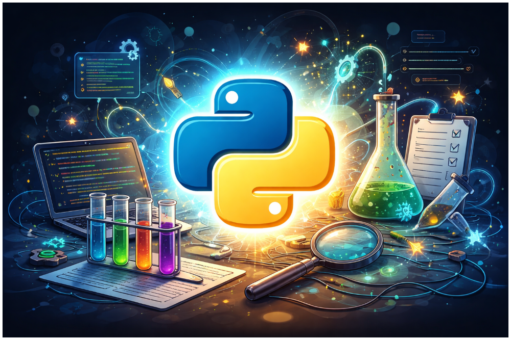

# Script Lab (Python Programs)

This is a collection of small but notable Python programs.

It serves as a lightweight lab for experimenting with ideas, learning concepts, and sharing practical scripts.



<br>

## 🛠️ | Project Overview

- `mvc-todo-app.py`
  - A simple to-do list application built with Tkinter, demonstrating the basic MVC workflow: user input → controller logic → model updates → view refresh
- `mvc-water-reminder.py`
  - A Tkinter-based reminder application used to further practice MVC separation, controller-driven events, and state handling

*More scripts will follow.*

<br>

## 🚀 | Installation

1. Clone the repository
```
git clone https://github.com/nickw07/script-lab-python.git
cd script-lab-python
```

2. Recommended: Create a virtual environment and activate it *(Example shows activation in CMD)*
```
python -m venv .venv
```
```
.venv\Scripts\activate.bat
```

3. Install required packages
```
pip install -r requirements.txt
```

4. Run the Python File you would like to test (Example: `mvc-water-reminder.py` in the project folder)
```
python mvc-water-reminder.py
```

<br>

## 🐛 | Bugs
- Feel free to report any bugs